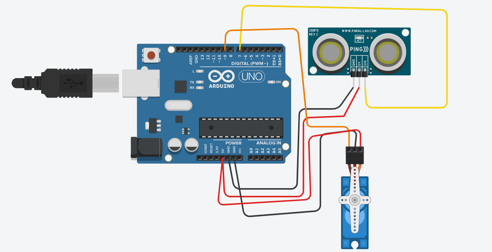

# Arduino-Ultrasonic-Radar
180° Ultrasonic Radar System using Arduino &;Processing
## Demo

## Circuit Diagram

### Connections Used
- **PING))) Sensor SIG** → Arduino **D11**
- **Servo Signal** → Arduino **D9** 
- **VCC** → 5V, **GND** → GND
## 👩‍💻 Author
**Pavithra Molagavelli**  
Embedded Systems Enthusiast | Arduino & IoT Developer

Connect with me: [LinkedIn](https://www.linkedin.com/in/pavithra-molagavelli-613906326) | [GitHub](https://github.com/pavithramolagavalli-ops)
